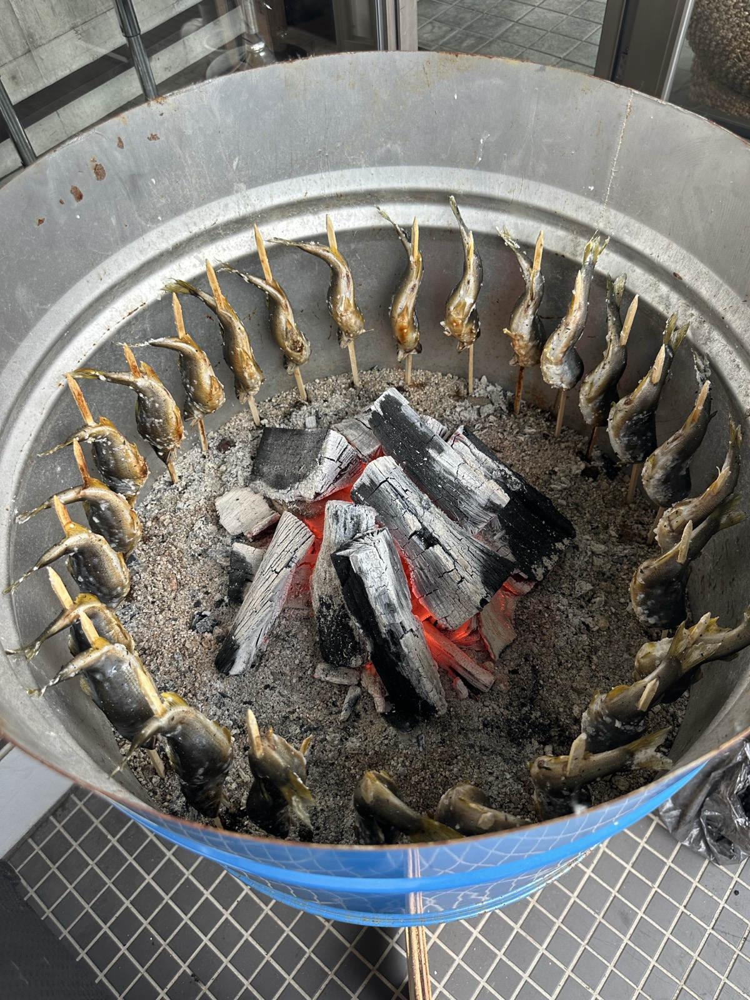
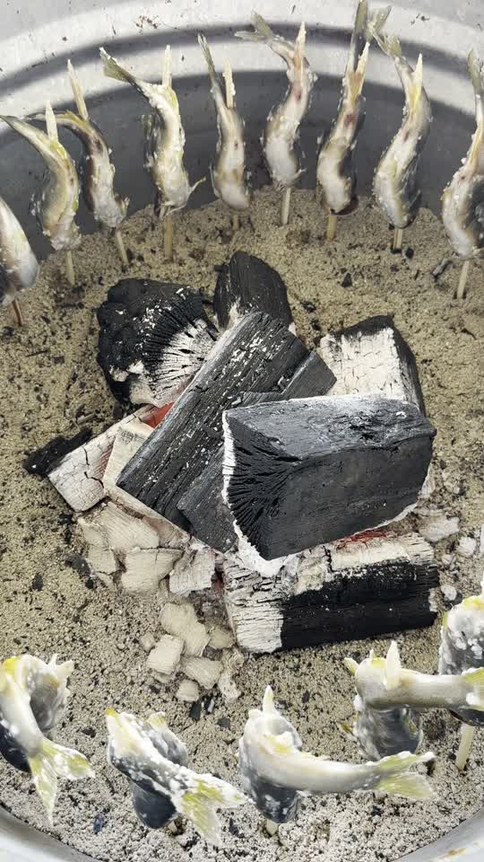

# Salt-Grilled Ayu — Thirty at a Time

*Ayu is a small sweetfish caught in Japanese rivers from early summer through autumn. This is how I grill it: over charcoal, in an open drum, thirty fish at once, forty-five minutes per batch. The rig is handmade and the method is simple. The judgment is the part that takes years.*

  

<i>Thirty fish, one fire, one person. Every skewer stands at the same distance from the coals.</i>

## Watch it cook

  

<b><a href="media/ayu-drum-grill.mp4">▶ Play the video (12 seconds)</a></b> 
<i>Charcoal in a line down the sand. Salt on the skin. Bellies to the fire.</i>

## The rig

A steel drum, cut in half lengthwise, makes the pit. Fill the half-drum with sand, place charcoal in a line down the center of the sand, and light it.

That is the whole apparatus. The sand does two jobs: it holds the heat evenly, and it holds the skewers — each fish stands in the sand around the fire, angled toward the coals. This is why thirty fish can cook at once with one person tending them: the rig holds the fish so your hands are free to watch.

## Skewering — the M shape

Each fish goes on a long skewer, woven through the body so it bends into an **M shape**. The M is not decoration. A fish curved this way looks like it is still swimming — and a fish that looks alive on the skewer cooks evenly, because the bends hold the body's thickness at a consistent distance from the fire along its whole length.

The fish is not gutted. Ayu is grilled and eaten whole — the faint bitterness of the innards against the sweet flesh is the point of the dish. Trust it once before you judge it.

## Salt

Use good salt — this dish has exactly three ingredients (fish, salt, fire), so each one carries a third of the result. Coat both sides evenly.

## The fire — four faces, one pass each

Stand the skewered fish in the sand around the coals, **belly facing the fire**. The belly is the thickest, fattiest side; it goes first.

From here the rule is strict, and it is the heart of this method:

**Each fish has four faces. Each face is grilled exactly once.**

Belly first. Then rotate to the next face, and the next, and the last. Never back to a face that is already done. A face that returns to the fire dries out and takes on soot; a face done right the first time needs nothing more.

When to rotate each face is a judgment call, and I read three signs together: **how the juices drip, the color of the skin, and the aroma**. The drip tells you how the fat is rendering, the color tells you where the surface is, and the smell turns from wet fish to something sweet when a face is done. None of the three is enough alone; watch many batches and they start agreeing with each other. If you are starting out: err on the side of patience. The fire is low and far, and nothing about this method is fast.

## Time

**About forty-five minutes**, unhurried, for the full batch of thirty.

Slow fire at a distance is what makes the difference between grilled ayu and burnt fish: the skin dries and crisps, the fat renders through the flesh, the head and bones cook soft enough to eat. There is no shortcut that keeps all three.

## Serve

Straight off the skewer, whole, head first — or press gently along the body, pull the tail, and the spine draws out clean.

## Why thirty at once works

Nothing about one fish changes when there are thirty. The rig holds them all at the same distance, every fish gets the same four faces in the same order, and one person can tend the whole batch because the method never requires two hands in two places. Scale, in cooking as in anything else, comes from a process that does not cut corners — repeated exactly, every time.

*I write instructions for a living. This one just happens to smell better than most.*
